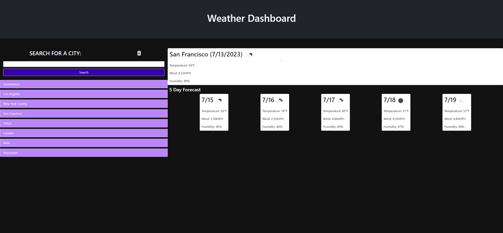

# Weather Dashboard
This site allows for the user to look up the current weather and five-day forecast for a desired city.



## Built With
* [JavaScript](https://developer.mozilla.org/en-US/docs/Web/JavaScript)
* [HTML](https://developer.mozilla.org/en-US/docs/Web/HTML)
* [CSS](https://developer.mozilla.org/en-US/docs/Web/CSS)
* [Git](https://git-scm.com/)
* [Bootstrap](https://getbootstrap.com/docs/5.3/getting-started/introduction/)
* [OpenWeather](https://openweathermap.org/guide)
* [DayJS](https://day.js.org/)

## Deployed Link

* [See Live Site](https://timothysu1.github.io/weather-dashboard/)

## Usage
The user will be able to enter a city in to the search bar and click search to bring up current weather and a five-day forecast. The city will be saved to a search history that the user can click on to bring back that cities weather. If the user clicks on the trashcan above the search bar, then they will clear their city search history.

## Learning Points 
* Requesting data from API's and using the given promise
* Reading documentation for an API in order to understand how to use it
* Troubleshooting errors that occur from fetching data

## Important Code

```js
var getCity = function (city) {
  var apiUrl = 'https://api.openweathermap.org/geo/1.0/direct?q=' + city + '&appid=' 
  + apiKey;
  fetch(apiUrl).then(function (response) {
    if (response.ok) {
      response.json().then(function (data) {
        console.log(data);
        getCurrentWeather(data)
      });
    } else {
      alert('Error: ' + response.statusText);
    }
  });
};
```

This piece of code shows how information is requested from an API and processed.

## Author Info

### Timothy Su

* [LinkedIn](https://www.linkedin.com/in/timothysu1/)
* [Github](https://github.com/timothysu1)


## Credits
Normalize.css: https://necolas.github.io/normalize.css/

## License

Please refer to license in the repo. 